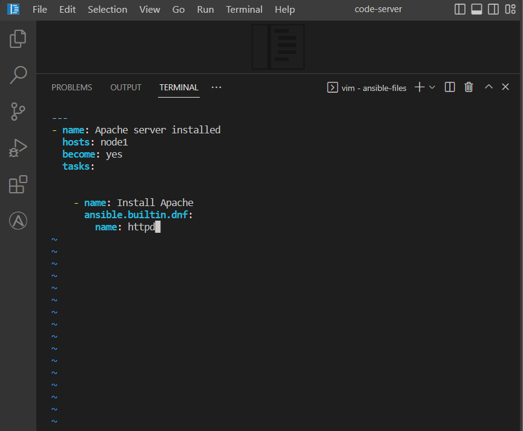
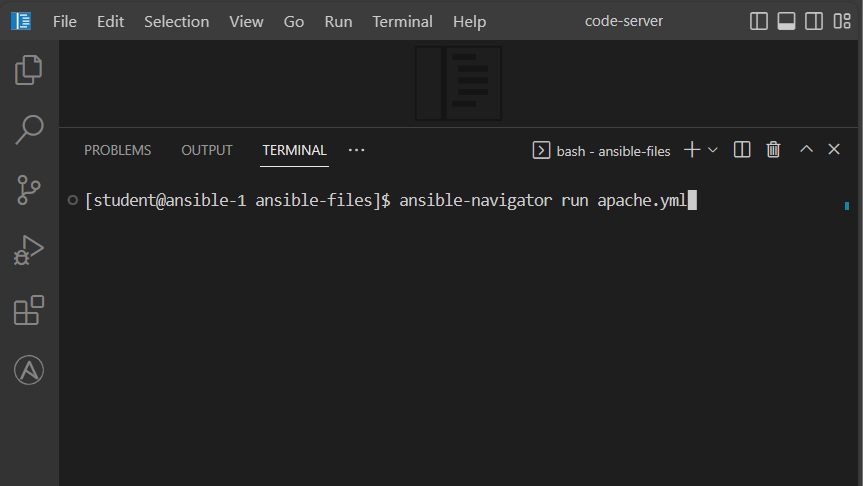
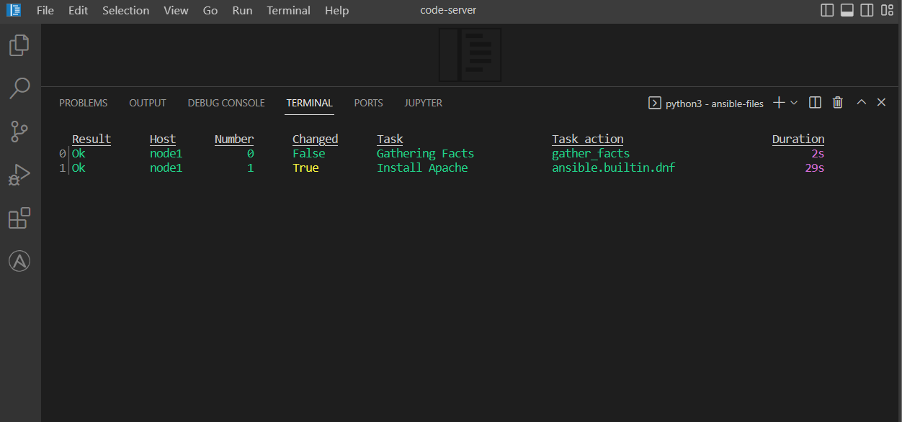
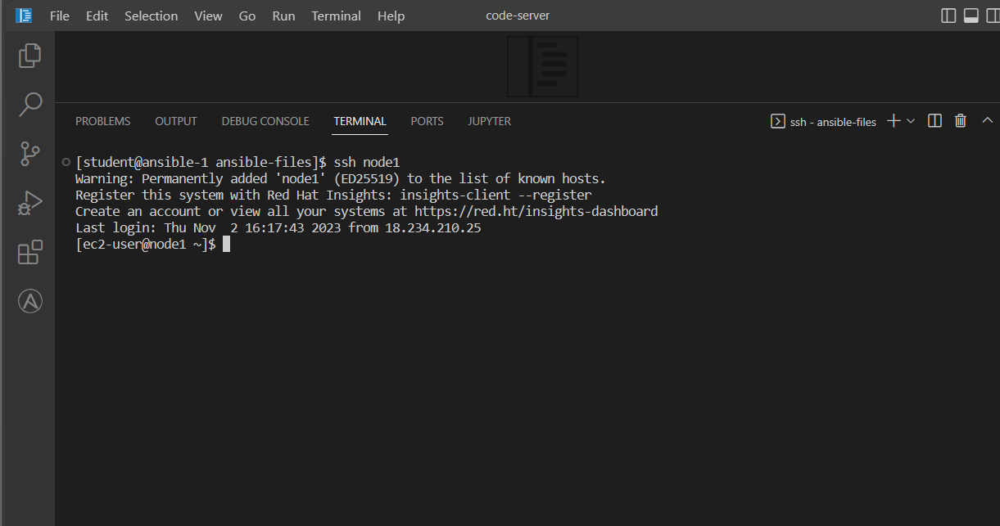
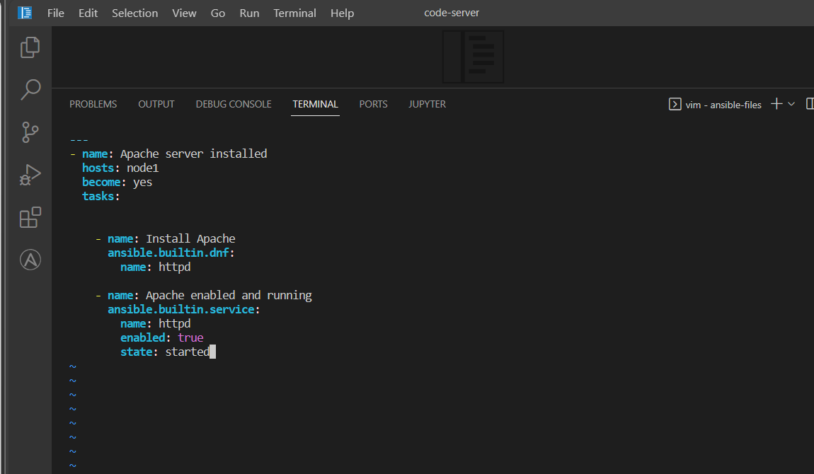

# ansible
<h1>Why use ansible?</h1>
 

 <ul>
<li>Ansible can be used to automate and make your systems better. It's simple, easy to learn and agentless.</li>
<li>Manage configurations, provision VMs, test and harden networks, deploy applications, deliver continuously, orchestration.</li>
 </ul>

 <h1><a href="https://docs.ansible.com/ansible/latest/dev_guide/overview_architecture.html"> Ansible Architecture </a></h1>
 <h3><i>Build --> Publish --> Deliver</i></h3>
 

  <ul>
   <li>Modules - do the things in Ansible. Ansible works by connecting to your nodes and pushing out scripts called “Ansible modules” to them.</li>
   <li>Plugins - pieces of code that augment Ansible's core functionality</li>
   <li>Collections - data structure containing automation content (Modules, Playbooks, Roles, Plugins, etc) This is housed in the automation hub. </li>
   <li>Playbooks - orchestrate multiple slices of your infrastructure topology. They run in sequential order.</li>
  </ul>
 

 <h1>Getting Started</h1>
 
Starting in Visual Studio Code, I opened a new terminal and created a directory called <i>ansible-files</i> and then navigated to that directory

 

  
  <h1>Create the Playbook and run the Playbook</h1>
  
Create an apache.yml file using the vim editor

 

  
  
Use the command <i>ansible-navigator run apache.yml</i> This will install the Apache server.

 

 
Once the playbook is completed, I connect to node1 using SSH to check that Apache has been installed. Exit and create a new file called <i>package.yml</i>. Run this using <i>ansible-navigator run package.yml</i>

 

 

 

